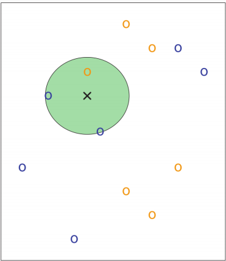
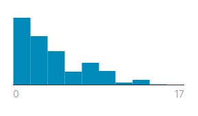
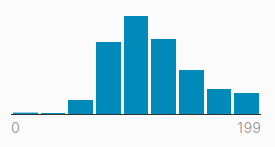
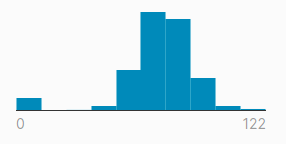
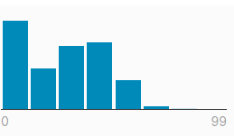
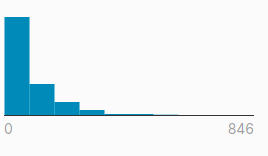
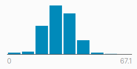
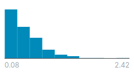
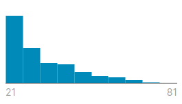

# Logistic Classification Practice
This repo is used for a KNN-Based Classification Practice

## Credits
Profesor: Dr. Andrés Hernández Gutiérrez

Student: Alan Rocha

## About KNN-Based Classification
KNN is a non-parametric supervised learning that can be used for both classification and regression.
In the context of classification, KNN can be definided as:
Given a positive integer K and a test observation x0, the KNN classifier first identify the K points
in the training data that are closest to x0.

## About the data set

###  Diabetes Prediction
This dataset is originally from the National Institute of Diabetes and Digestive and Kidney Diseases. The objective of the dataset is to diagnostically predict whether or not a patient has diabetes, based on certain diagnostic measurements included in the dataset. Several constraints were placed on the selection of these instances from a larger database. In particular, all patients here are females at least 21 years old of Pima Indian heritage. (_Pima Indians Diabetes Database, 2016_)

### Characteristics

Characteristics | Histogram | 
--- | --- |
Pregnancies (_Number of times pregnant_) |  |
Glucose (_Plasma glucose concentration a 2 hours in an oral glucose tolerance test_) |  |
BloodPressure (_Diastolic blood pressure (mm Hg)_)|  |
SkinThickness (_Triceps skin fold thickness (mm)_) |  |
Insulin (_2-Hour serum insulin (mu U/ml)_) |  |
BMI (_Body mass index (weight in kg/(height in m)^2)_) |  |
DiabetesPedigreeFunction (_Diabetes pedigree function_) |  |
Age (_In years_) |  |

## Discussion

### Data set
There are some features that may be not applicable. For example, I don't know how much the Pregnancies feature can contribute to the model. Excessive features are likely cause that the generated model may not be as precise and accurate as it could be. Since the dataset has a lot of features, the data set should be scaled in order to improve time performance.

### Results
The data is shuffled each time the program is executed, so it was decided to make a table with the variables of confusion matrix, running the program 10 times. Also we tested with K = 5, 10, 20.

#### K = 5
C.M.V | 1 | 2 | 3 | 4 | 5 | 6 | 7 | 8 | 9 | 10 | Avg. |
--- | --- | --- | --- | --- | --- | --- | --- | --- | --- | --- | --- |
TP | 7 | 9 | 6 | 5 | 9 | 7 | 4 | 10 | 10 | 3 | 7 |
TN | 19 | 20 | 24 | 20 | 17 | 24 | 22 | 20 | 21 | 30 | 21.7 |
FP | 1 | 4 | 4 | 6 | 6 | 4 | 8 | 5 | 3 | 2 | 7 | 4.3 |
FN | 11 | 5 | 4 | 7 | 6 | 3 | 4 | 3 | 4 | 3 | 5 |

Metric | Accuracy | Precision | Recall | Specificity | F1 score |
--- | --- | --- | --- | --- | --- |
Average | 0.75526 | 0.61947 | 0.58333 | 0.83462 | 0.60086 |

#### K = 10
C.M.V | 1 | 2 | 3 | 4 | 5 | 6 | 7 | 8 | 9 | 10 | Avg. |
--- | --- | --- | --- | --- | --- | --- | --- | --- | --- | --- | --- |
TP | 8 | 8 | 9 | 7 | 7 | 5 | 7 | 7 | 8 | 8 | 7.4 |
TN | 18 | 19 | 22 | 19 | 23 | 18 | 22 | 21 | 22 | 17 | 20.1 |  
FP | 9 | 6 | 4 | 4 | 3 | 7 | 0 | 4 | 2 | 9 | 4.8 | 
FN | 3 | 5 | 3 | 8 | 5 | 8 | 9 | 6 | 6 | 4 | 5.7 |

Metric | Accuracy | Precision | Recall | Specificity | F1 score |
--- | --- | --- | --- | --- | --- |
Average | 0.72368 | 0.60656 | 0.56489 | 0.80723 | 0.58498 |

#### K = 20
C.M.V | 1 | 2 | 3 | 4 | 5 | 6 | 7 | 8 | 9 | 10 | Avg. |
--- | --- | --- | --- | --- | --- | --- | --- | --- | --- | --- | --- |
TP | 8 | 7 | 5 | 4 | 3 | 3 | 11 | 3 | 11 | 8 | 6.3 |
TN | 23 | 22 | 25 | 25 | 25 | 25 | 19 | 26 | 22 | 23 | 23.5 |
FP | 3 | 1 | 3 | 2 | 3 | 6 | 1 | 2 | 0 | 2 | 2.3 |
FN | 4 | 8 | 5 | 7 | 5 | 4 | 7 | 7 | 5 | 5 | 5.7 |

Metric | Accuracy | Precision | Recall | Specificity | F1 score |
--- | --- | --- | --- | --- | --- |
Average | 0.78836 | 0.73256 | 0.52500 | 0.91085 | 0.61165 |

#### General
 K | Accuracy | Precision | Recall | Specificity | F1 score |
 --- | --- | --- | --- | --- | --- |
 5 | 0.75526 | 0.61947 | 0.58333 | 0.83462 | 0.60086 |
 10 | 0.72368 | 0.60656 | 0.56489 | 0.80723 | 0.58498 |
 20 | 0.78836 | 0.73256 | 0.52500 | 0.91085 | 0.61165 |

We can conclude with these results that the more the K value is increased, better is the performance metrics. However, this improvement is not linear, so it must be tested little by little until reaching the best K value. On the other hand, if the k value is increased too much, the metrics can be worse.

## References
Pima Indians Diabetes Database. (2016, October 6). Retrieved from [kaggle website](https://www.kaggle.com/uciml/pima-indians-diabetes-database)